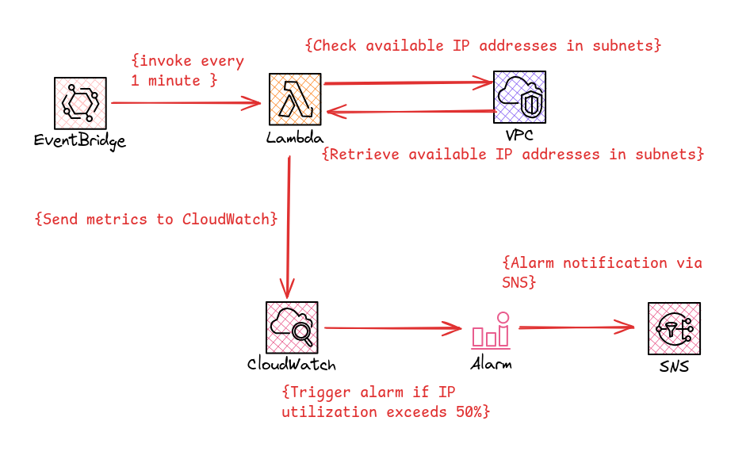

# Monitoring of Available IPs in AWS VPC Subnets

This project uses AWS SAM (Serverless Application Model) to deploy a solution that monitors IP address utilization in specified subnets and sends alerts when utilization exceeds a threshold.

You can find the full article here : https://dev.to/aws-heroes/use-amazon-q-developer-and-aws-infrastructure-composer-to-automate-the-monitoring-of-available-ip-addresses-in-subnets-1hip

## Prerequisites

1. AWS CLI installed and configured with appropriate permissions
2. AWS SAM CLI installed
3. Python 3.12 installed

## Deployment Steps

1. Clone this repository:

2. Modify the `template.yaml` file to adjust default parameter values or add/remove resources as needed. eg: VPC ID, Subnet Name, Subnet ID, CloudWatch Metric Namespace.

3. (Optional) Update the `lambda_function.py` file in the `src` directory.

4. Build the SAM application: `sam build`

5. Deploy the SAM application: `sam deploy --guided`

This will start an interactive deployment process. You'll be prompted to provide values for the parameters defined in the template. You can accept the default values or provide your own.

6. During the deployment, you'll be asked to confirm the creation of IAM roles and the changes to be applied. Review and confirm these.

7. Once the deployment is complete, SAM will output the ARNs of the created Lambda function and SNS topic.

## Parameters

- `VpcId`: The ID of the VPC to monitor
- `SubnetIds`: Comma-separated list of subnet IDs to monitor
- `SubnetName1`: Name of the first subnet
- `SubnetName2`: Name of the second subnet
- `CWMetericNamespace`: The CloudWatch metric namespace
- `AlertEmail`: Email address to receive alerts

## Resources Created

- Lambda function for monitoring subnets
- EventBridge rule to trigger the Lambda function every minute
- SNS topic for sending alerts
- CloudWatch alarms for each monitored subnet

## Customization

- To monitor more than two subnets, duplicate the `SubnetUtilizationAlarm` resource in the template and adjust the `SubnetIds` parameter.
- Modify the Lambda function code in `src/lambda_function.py` to implement your specific monitoring logic.
- Adjust the alarm thresholds and evaluation periods in the `SubnetUtilizationAlarm` resources as needed.

This will start an interactive deployment process. You'll be prompted to provide values for the parameters defined in the template. You can accept the default values or provide your own.

6. During the deployment, you'll be asked to confirm the creation of IAM roles and the changes to be applied. Review and confirm these.

7. Once the deployment is complete, SAM will output the ARNs of the created Lambda function and SNS topic.

## Parameters

- `VpcId`: The ID of the VPC to monitor
- `SubnetIds`: Comma-separated list of subnet IDs to monitor
- `SubnetName1`: Name of the first subnet
- `SubnetName2`: Name of the second subnet
- `CWMetericNamespace`: The CloudWatch metric namespace
- `AlertEmail`: Email address to receive alerts

## Resources Created

- Lambda function for monitoring subnets
- EventBridge rule to trigger the Lambda function every minute
- SNS topic for sending alerts
- CloudWatch alarms for each monitored subnet

## Customization

- To monitor more than two subnets, duplicate the `SubnetUtilizationAlarm` resource in the template and adjust the `SubnetIds` parameter.
- Modify the Lambda function code in `src/lambda_function.py` to implement your specific monitoring logic.
- Adjust the alarm thresholds and evaluation periods in the `SubnetUtilizationAlarm` resources as needed.

## Cleanup

To remove all resources created by this stack: `sam delete`

Follow the prompts to confirm the deletion of resources.

## Support

For any issues or questions, please open an issue in the GitHub repository.
